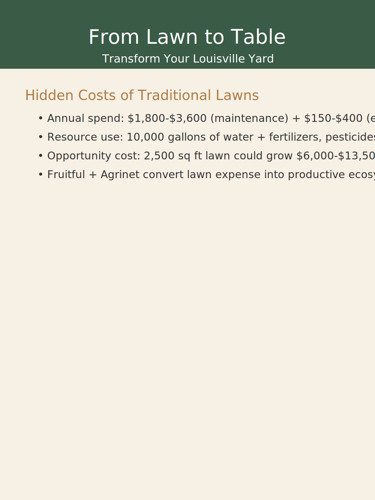
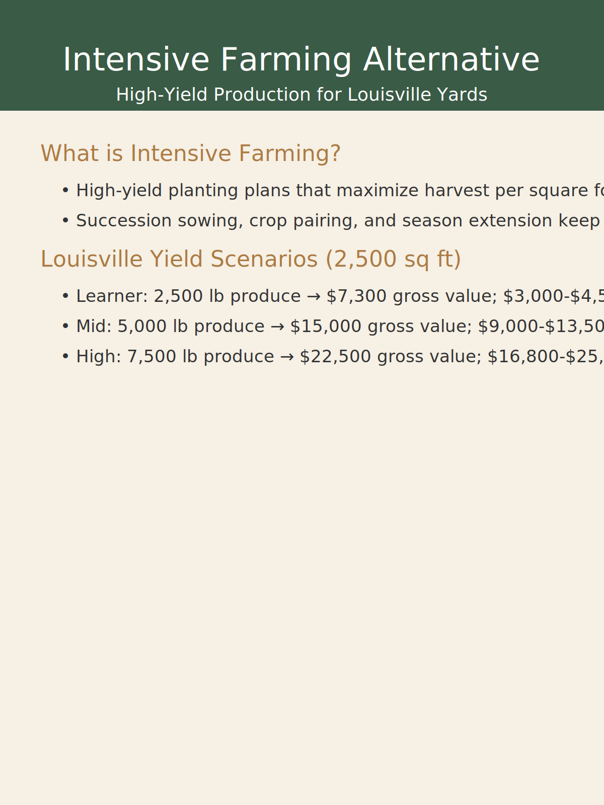
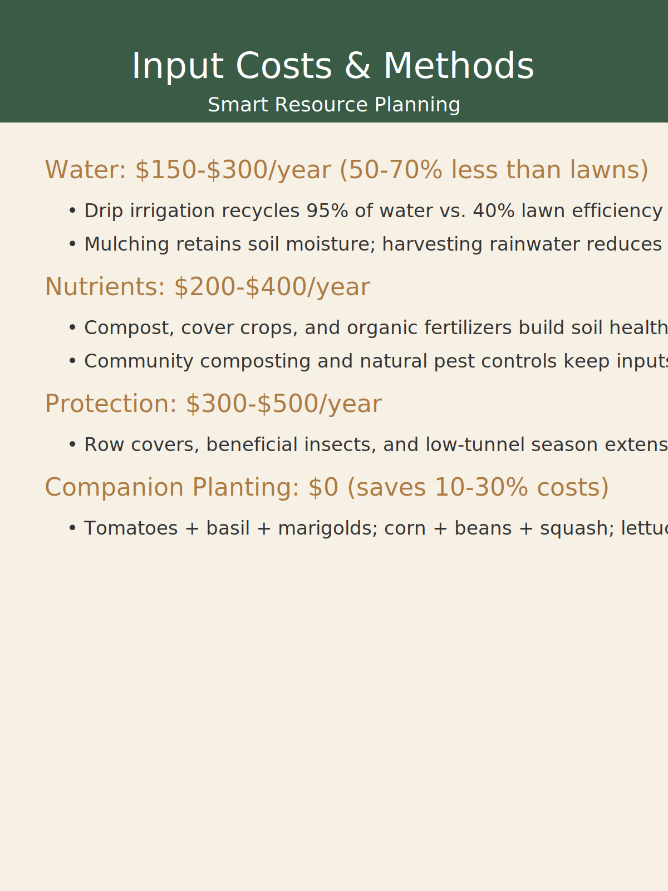
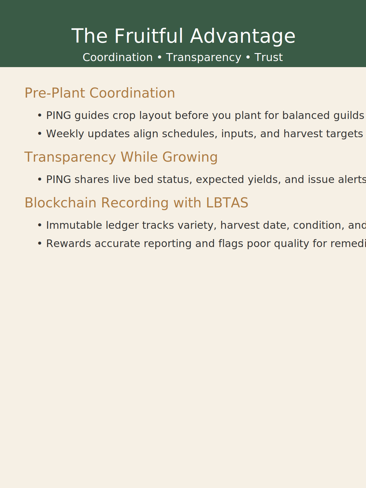
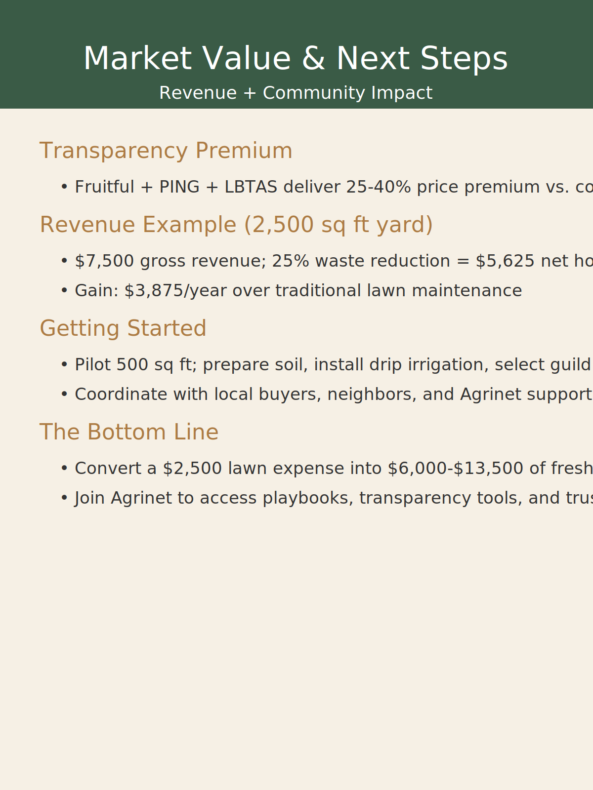

Louisville households are spending thousands each year to keep turf grass alive while a thriving network of buyers seeks transparent, local produce. Agrinet's Fruitful playbooks make it practical to flip that expense into a resilient ecosystem that serves neighbors, chefs, and mutual aid partners. This guide distills the latest agronomic, economic, and trust-building practices our core team is deploying with homeowners across Jefferson County.

## Lawn economics vs. edible ecosystems

Maintaining a conventional lawn can run $1,800–$3,600 annually before equipment purchases and requires more than 10,000 gallons of water each year. By contrast, a 2,500-square-foot Fruitful layout can generate $6,000–$13,500 in annual value while recycling water, nutrients, and data across the Agrinet network.

Key shifts include:

- Reallocating lawn care spending into soil health investments and resilient infrastructure.
- Capturing rainwater and using drip irrigation to achieve up to 70% water savings versus turf.
- Tracking every input and harvest through Agrinet so nothing is wasted.

## Intensive farming alternatives tailored for Louisville

Fruitful's bed maps, succession planting calendars, and season extension kits maximize harvests from tight urban and suburban parcels. Depending on experience level, growers can expect:

- **Learner crews** to produce roughly 2,500 pounds of vegetables, translating to $7,300 in gross value and $3,000–$4,500 in grocery savings.
- **Mid-tier growers** to double production while unlocking $9,000–$13,500 in household savings.
- **High-optimization teams** to reach 7,500 pounds and more than $16,000 in annual savings.

## Managing inputs with regenerative discipline

Designing for loops keeps costs predictable:

- Drip irrigation and mulching retain moisture, while cisterns capture Louisville's seasonal rainfalls.
- Composting, cover crops, and local nutrient exchanges maintain fertility without synthetic imports.
- Row covers, beneficial insects, and low tunnels provide natural protection and shoulder-season supply.
- Companion planting guilds—tomatoes with basil and marigolds, the Three Sisters mix, and quick greens successions—deliver 10–30% input savings.

## Transparency that scales trust

The Fruitful Advantage combines three pillars:

1. **Pre-plant coordination** with PING ensures each bed has a purpose before seeds go in the ground.
2. **In-season transparency** keeps growers and buyers aligned on yields, issues, and availability.
3. **Immutable blockchain records** through LBTAS reward accurate reporting and flag discrepancies early.

## Monetizing surplus and onboarding neighbors

Combining Fruitful crop plans, PING transparency, and LBTAS settlement consistently unlocks a 25–40% premium compared with anonymous wholesale channels. A representative 2,500-square-foot yard nets $5,625 after waste reduction—about $3,875 better than paying for lawn upkeep.

Getting started is straightforward:

- Pilot a 500-square-foot micro-farm to test irrigation, soil amendments, and harvest cadence.
- Coordinate with local buyers, CSA hosts, and mutual aid partners via Agrinet's directories.
- Document every delivery and quality check in LBTAS to build a premium-ready ledger from day one.

Ready to turn lawn care costs into community wealth? Join the Agrinet federated agriculture network and tap into Fruitful's templates, training, and blockchain backed accountability.

