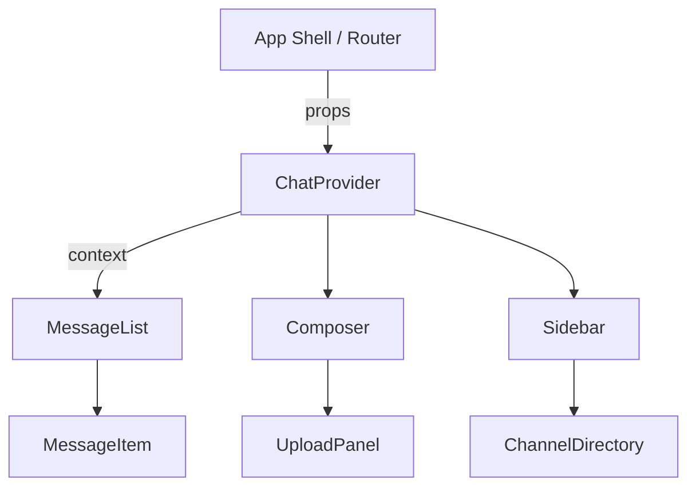

import Tabs from '@theme/Tabs';
import TabItem from '@theme/TabItem';

# Agrinet Frontend Chat UI

The Agrinet chat experience gives growers, agronomists, and service partners a real-time space to collaborate inside the Agrinet web portal. This guide explains how the **chat-ui** package is structured, how it connects to backend messaging services, and how teams can theme or extend the experience for their tenant deployments.

## Feature overview

Agrinet chat delivers the following capabilities out of the box:

- **Threaded conversations** with support for channel, group, and direct message contexts.
- **Presence and typing indicators** powered by WebSocket subscriptions.
- **Rich media uploads** (images, PDFs, agronomic sensor snapshots) with automatic thumbnailing.
- **Conversation search** that filters messages by keyword, participant, or tagged asset.
- **Localization hooks** that route every string through the `@agrinet/i18n` provider.
- **Accessibility-first UI** with keyboard navigation, ARIA roles, and high-contrast themes.
- **Tailwind CSS utility classes** that ship with the bundle for rapid theming and extension.

## Architecture

The chat UI is delivered as a standalone React package that slots into the Agrinet shell application. The high-level layers look like this:



- `ChatProvider` bootstraps authentication, opens the realtime transport, and exposes state via React context.
- `MessageList`, `Composer`, and `Sidebar` are the primary regions. Each sub-component accepts render prop overrides so product squads can tailor layouts without forking.
- The provider delegates persistence to the Agrinet messaging API. Transport adapters (WebSocket, Server-Sent Events, polling) live under `src/adapters` and can be swapped based on deployment constraints.

## Installation and bootstrapping

1. Install the package inside the Agrinet frontend monorepo:

```bash
yarn workspace agrinet-frontend add @agrinet/chat-ui
```

2. Register the module with the application shell. Update the tenant bootstrap (for example `apps/tenant/src/bootstrap.tsx`) to wrap the router with `ChatProvider` and pass in environment-specific settings:

```tsx
import { ChatProvider } from '@agrinet/chat-ui';
import { AgrinetApiClient } from '@agrinet/sdk';

const client = new AgrinetApiClient({
  baseUrl: process.env.AGRINET_API_URL!,
  tokenProvider: () => auth.getAccessToken(),
});

root.render(
  <ChatProvider
    transport="websocket"
    apiClient={client}
    featureFlags={featureFlags}
    fileUpload={{ bucket: process.env.AGRINET_UPLOAD_BUCKET }}
  >
    <AppRouter />
  </ChatProvider>,
);
```

3. Expose chat routes and navigation. Add entries to the shell's route config and top-level navigation so users can launch into `/chat`, `/chat/:channelId`, or `/chat/drafts`.

<Tabs>
  <TabItem value="react" label="React Router" default>

```tsx
import { ChatRoutes } from '@agrinet/chat-ui';

const routes = [
  // ...existing routes
  {
    path: '/chat/*',
    element: <ChatRoutes />,
  },
];
```

  </TabItem>
  <TabItem value="next" label="Next.js">

```tsx
// app/chat/page.tsx
import { ChatPage } from '@agrinet/chat-ui/next';

export default function Chat() {
  return <ChatPage />;
}
```

  </TabItem>
</Tabs>

## Configuration reference

| Setting | Description | Default |
| --- | --- | --- |
| `transport` | Realtime adapter. Options: `websocket`, `sse`, `polling`. | `websocket` |
| `apiClient` | Instance of the Agrinet SDK used for REST calls. | Required |
| `featureFlags` | Optional record toggling beta capabilities (`threadedReplies`, `messageReactions`, `autoTranslate`). | `{}` |
| `fileUpload.bucket` | Object store bucket/collection for attachments. | `undefined` |
| `presence.pollIntervalMs` | Interval for background presence refresh when polling. | `30000` |
| `logger` | Structured logger implementing `info`, `warn`, `error`. | Console logger |

Configuration can come from environment variables, tenant metadata, or user preferences. All props are fully typed so integrators receive IntelliSense in TypeScript projects.

## Theming and customization

The chat UI ships with default light and dark themes that match the Agrinet design system. Override tokens or slot in custom components to align with tenant branding:

```tsx
import { ChatProvider, useChatTheme } from '@agrinet/chat-ui';

const desertTheme = {
  colors: {
    background: '#f6efe6',
    accent: '#c06e24',
    badge: '#2f855a',
  },
};

function TenantChatProvider({ children }) {
  return (
    <ChatProvider theme={desertTheme}>
      {children}
    </ChatProvider>
  );
}

function MessageItem(props) {
  const theme = useChatTheme();
  return (
    <div style={{ background: theme.colors.background }}>
      {/* custom rendering */}
    </div>
  );
}
```

For advanced customization, override render props such as `renderMessageItem`, `renderComposer`, or `renderSidebarSection`. Each callback receives strongly typed payloads so you can add agronomic charts, weather overlays, or device telemetry widgets inline with conversations.

## Testing strategy

Use the provided React Testing Library helpers to validate message flows without a live backend:

```tsx
import { renderChat, fireMessage } from '@agrinet/chat-ui/testing';

test('grower can respond to advisor in channel thread', async () => {
  const { findByText, typeMessage } = renderChat();

  await typeMessage('Moisture dropped below target. Please advise.');
  fireMessage({ from: 'advisor', body: 'Switch to 30% irrigation tonight.' });

  expect(await findByText('Switch to 30% irrigation tonight.')).toBeInTheDocument();
});
```

- Mock transports implement the same interface as production adapters, enabling deterministic tests.
- Snapshots of `MessageList` and `Sidebar` help prevent unintended UI regressions during upgrades.
- Include end-to-end coverage with Playwright or Cypress to validate uploads, notifications, and offline scenarios.

## Operational checklist

Before rolling out chat to a tenant:

1. Confirm message retention policies match contractual requirements.
2. Configure moderation webhooks to flag prohibited content or escalate urgent agronomic alerts.
3. Validate S3/Blob storage lifecycle rules for uploaded media.
4. Perform load testing on the messaging API with expected concurrent users per tenant.
5. Document runbooks for reconnect storms, transport failover, and notification delivery latency.

Once these steps are complete, the Agrinet chat UI is ready for pilot users. Gather telemetry with the Agrinet analytics SDK to continuously improve conversation quality and response times.
